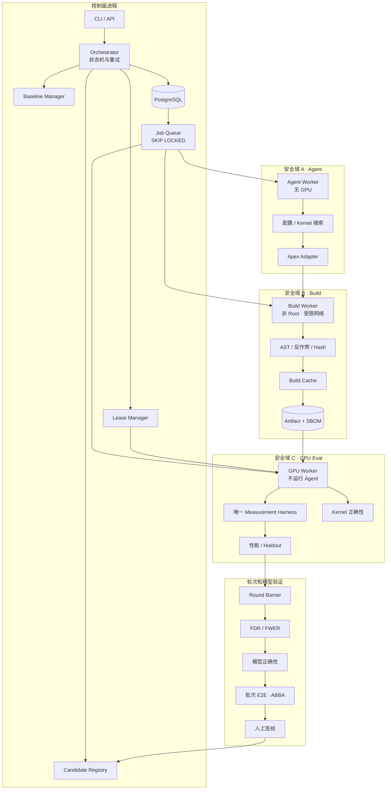
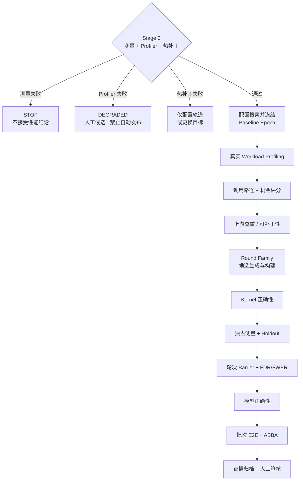
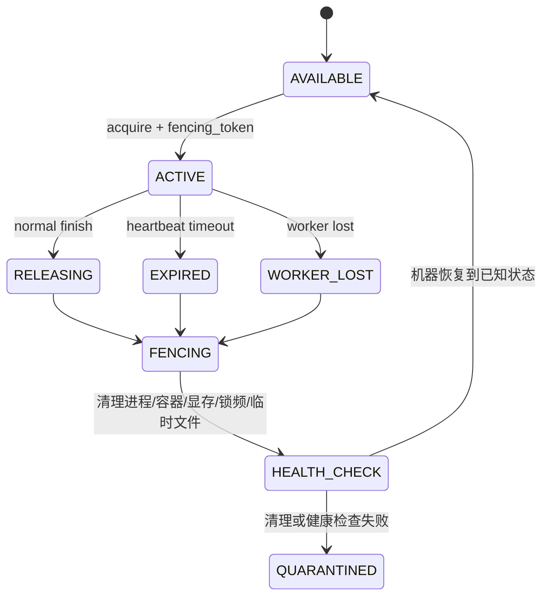

# 整体架构 v0.1

## 1. 系统定位

本系统不是单纯的 Kernel 生成器，而是面向 DCU 推理 Workload 的可信自动优化控制面。MVP 支持配置与可热补丁 Kernel；未来可扩展融合、内存、调度和通信轨道，但所有轨道必须共享同一套基线、测量、证据和恢复规则。

核心原则：

1. Stage 0 先于工程扩张；测量不可信就停止。
2. 控制面与执行面分离，Agent 不接触 GPU 评测环境。
3. 正确性与计时使用不同资源池；计时必须持独占安静设备。
4. 配置搜索先胜出并冻结 Baseline Epoch，再进行 Kernel 搜索。
5. 多候选统计校正是轮次级 Barrier，不是单候选步骤。
6. 所有晋级结论绑定环境指纹、Workload、基线和不可变 Artifact。
7. 租约过期不代表资源可用，必须完成 Fencing 与健康检查。

## 2. 部署结构

MVP 采用 **Python Monorepo + 模块化单体控制面 + 独立 Worker 进程**，避免四人团队过早承担微服务治理成本。



Worker 可以在同一仓库中以不同命令启动，但部署时放入不同容器或机器权限域：

```text
dcuopt worker agent
dcuopt worker build
dcuopt worker gpu
```

## 3. 主数据流



## 4. 资源租约

| 租约 | 用途 | 典型阶段 |
|---|---|---|
| Functional | 共享或单卡功能池，不用于性能结论 | Kernel 正确性、加载 Smoke |
| Measurement | 独占安静设备，采集频率/功耗/温度 | Profiling、Kernel 性能、Holdout |
| Topology | 独占整机、多卡与 NUMA 拓扑 | 配置搜索、多卡/服务 E2E |

Lease 的释放状态机：



每次执行请求携带单调递增的 `fencing_token`。旧 Worker 即使复活，也不能使用旧 token 写回结果或继续占用设备。

## 5. 控制面模块

| 模块 | 责任 | 不负责 |
|---|---|---|
| Orchestrator | 状态流转、Job 创建、失败恢复、预算 | 具体测量与 Agent 推理 |
| Baseline Manager | 冻结配置、硬件/软件/Workload 指纹 | 决定候选胜负 |
| Lease Manager | 资源冲突、续租、Fencing 状态 | DCU 厂商级清理命令实现 |
| Profiler Adapter | 统一不同 DTK/Profiler 输出 | 候选生成 |
| Search Controller | 轮次、父子关系、Beam/Top-K、预算 | 性能判定 |
| Build | 隔离编译、缓存、Hash、SBOM | 运行 Agent 或直接发布 |
| Evaluation | 正确性、测量、统计、模型/E2E | 改写候选源码 |
| Registry | Artifact 和证据索引、签核状态 | 决定测量阈值 |

## 6. 故障与降级

- 测量闸门失败：项目状态 `STOPPED_MEASUREMENT`，暂停性能相关工作。
- Profiler 缺失：`DEGRADED_MANUAL_INTAKE`，只允许人工候选，禁止自动发布。
- 热补丁不可行：改为配置轨道或选择可补丁目标；不把 `_C.so` 偷渡进 MVP。
- Lease 清理失败：资源进入 `QUARANTINED`，不能自动重新分配。
- PostgreSQL 不可用：Worker 停止领取新 Job；已领取任务保存本地退出证据，不以 SQLite 降级生产队列。

## 7. 非目标

- 用一个通用 Agent 自动修改所有推理栈层级。
- 在 MVP 中自动修改驱动、系统 BLAS、通信库或整仓 `_C.so`。
- 把单次微基准提升直接宣称为模型端到端收益。
- 把租约 TTL 当成进程、显存和锁频已清理的证据。

