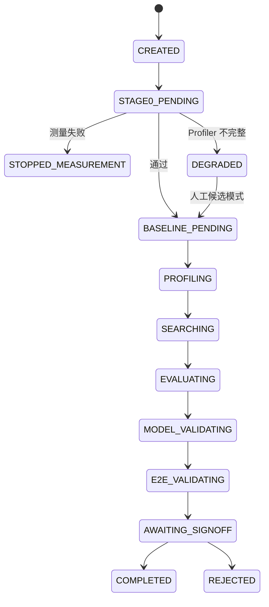
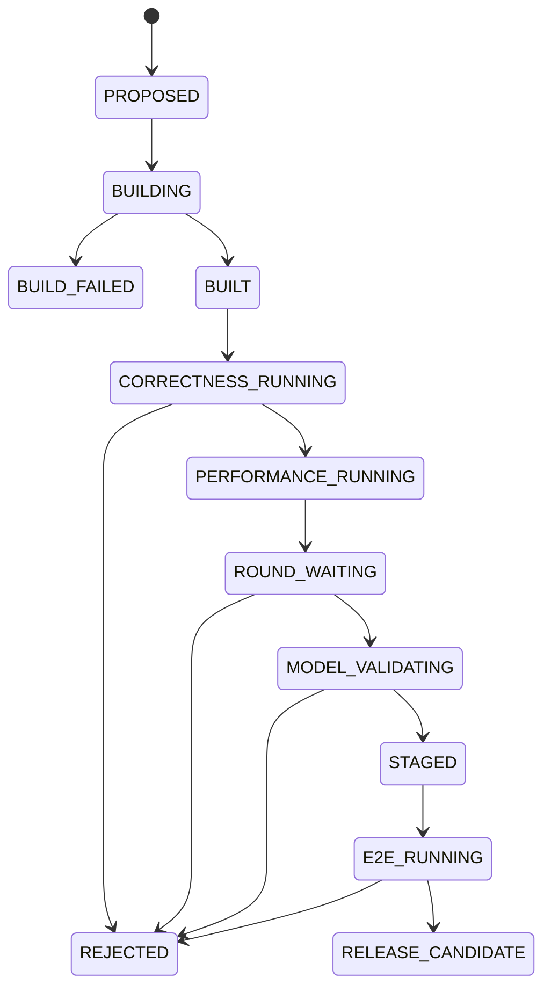

# 状态机

## Task

```mermaid
stateDiagram-v2
    [*] --> CREATED
    CREATED --> STAGE0_PENDING
    STAGE0_PENDING --> STOPPED_MEASUREMENT: 测量失败
    STAGE0_PENDING --> DEGRADED: Profiler 不完整
    STAGE0_PENDING --> BASELINE_PENDING: 通过
    DEGRADED --> BASELINE_PENDING: 人工候选模式
    BASELINE_PENDING --> PROFILING
    PROFILING --> SEARCHING
    SEARCHING --> EVALUATING
    EVALUATING --> MODEL_VALIDATING
    MODEL_VALIDATING --> E2E_VALIDATING
    E2E_VALIDATING --> AWAITING_SIGNOFF
    AWAITING_SIGNOFF --> COMPLETED
    AWAITING_SIGNOFF --> REJECTED
```

## Candidate

```mermaid
stateDiagram-v2
    [*] --> PROPOSED
    PROPOSED --> BUILDING
    BUILDING --> BUILD_FAILED
    BUILDING --> BUILT
    BUILT --> CORRECTNESS_RUNNING
    CORRECTNESS_RUNNING --> REJECTED
    CORRECTNESS_RUNNING --> PERFORMANCE_RUNNING
    PERFORMANCE_RUNNING --> ROUND_WAITING
    ROUND_WAITING --> REJECTED
    ROUND_WAITING --> MODEL_VALIDATING
    MODEL_VALIDATING --> REJECTED
    MODEL_VALIDATING --> STAGED
    STAGED --> E2E_RUNNING
    E2E_RUNNING --> REJECTED
    E2E_RUNNING --> RELEASE_CANDIDATE
```

状态流转由控制面统一执行，并使用 expected-state 比较避免两个 Worker 同时推进同一对象。

