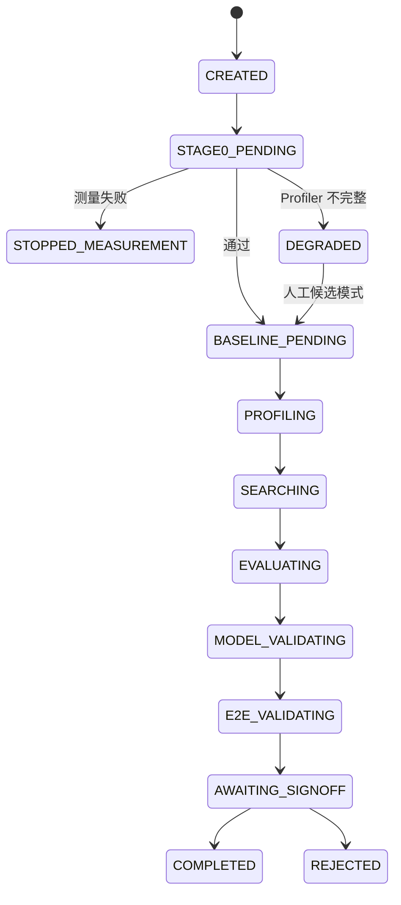
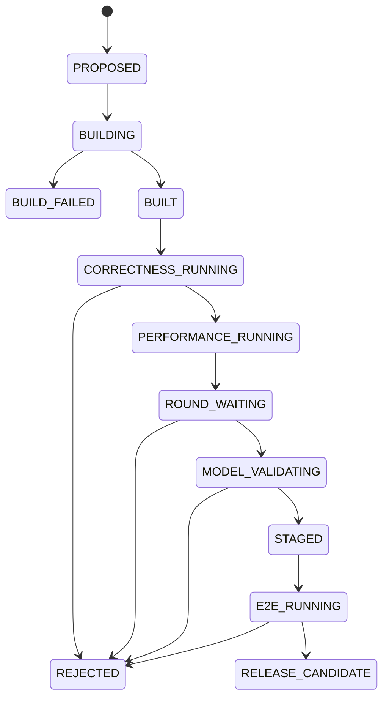
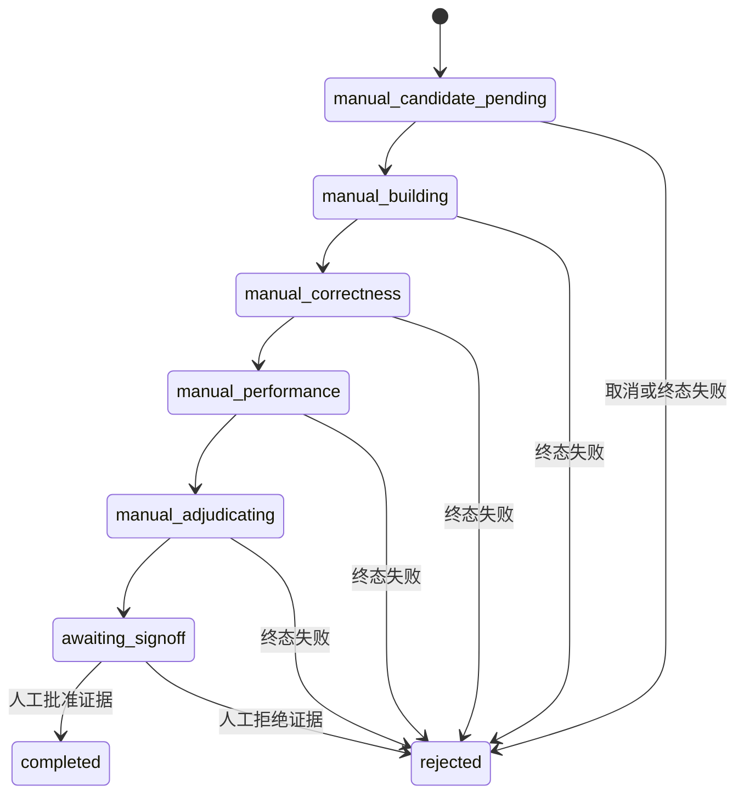
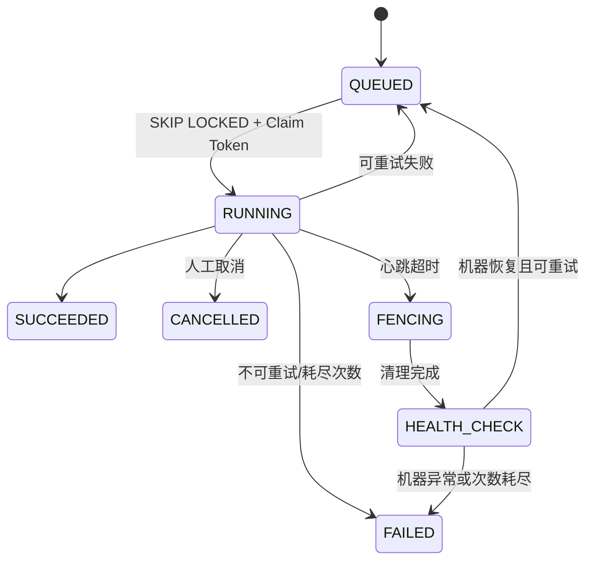

# 状态机

## 阅读边界

本页最前面的 Task/Candidate 图是最初定义的**完整 MVP 目标状态机**，用于说明从 Profiling、
Search 到模型/E2E 的最终方向；它不表示 M2、M3 或自动发布已经实现。当前已落地的权威链是
F1、Stage 0 和下文的 M1 单人工 Candidate 状态机。M2a 的轮次状态仍是 Proposed，必须以
ADR-0009 和 Contract 评审结果为准。

## 完整 MVP 目标：Task



## 完整 MVP 目标：Candidate



状态流转由控制面统一执行，并使用 expected-state 比较避免两个 Worker 同时推进同一对象。

## 已实现：M1 单人工 Candidate



M1 Candidate 的成功路径为
`proposed → building → built → correctness_running → performance_running → adjudicating → awaiting_signoff → accepted`；
Build 终态失败为 `build_failed`，其余终态失败和人工拒绝为 `rejected`。M1 保持一 Task 一
Candidate，不能用它表达批级 Barrier。

## Proposed：M2a SearchRound

M2a 拟新增独立 `SearchRound`，而不是修改上面的 M1 链。拟议顺序为：

```text
intake_open → intake_closed → building → correctness
→ search_measuring → search_barrier
→ holdout_measuring → holdout_barrier
→ awaiting_signoff → completed | rejected
```

这只是设计草案，当前枚举、数据库和 API 尚未提供这些状态。详见
[ADR-0009](adr/0009-m2a-round-barrier.md) 和 [M2 Contract 草案](m2-contract-draft.md)。

## Job 与 GPU Lease



数据库中的资源只有经过 `FENCING → HEALTH_CHECK → AVAILABLE` 才能重新领取。租约过期本身不表示 GPU 已空闲。
